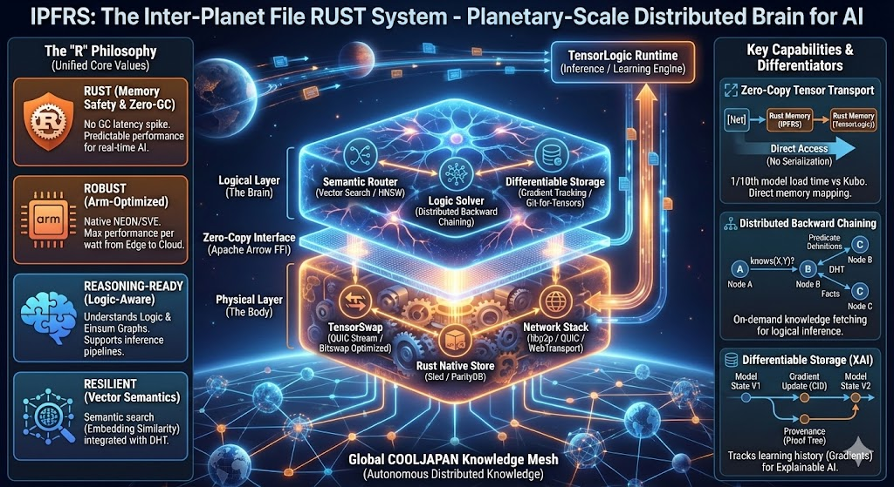
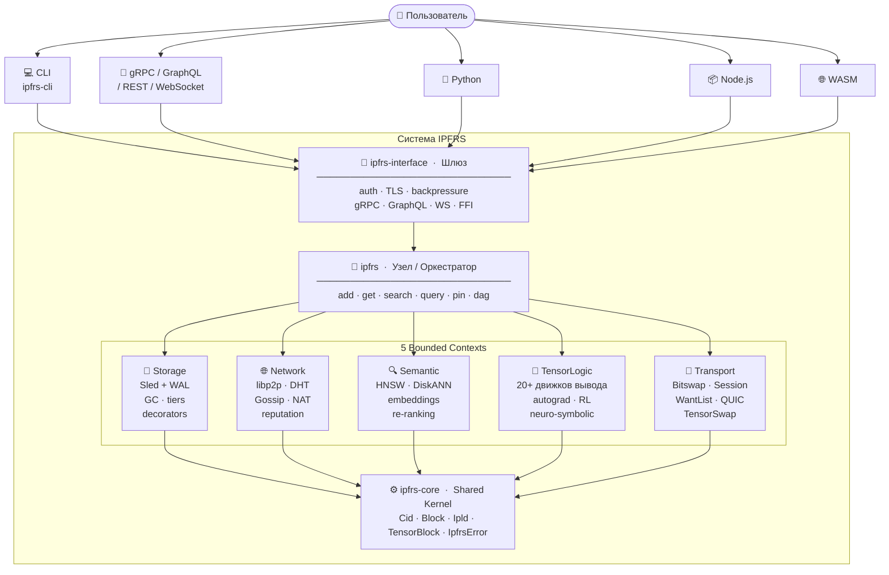
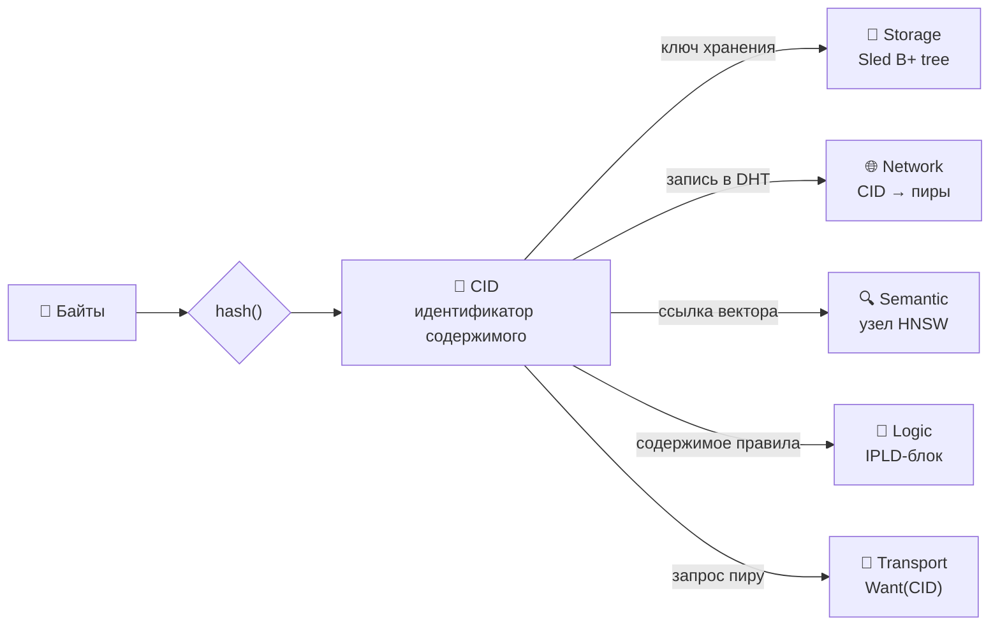
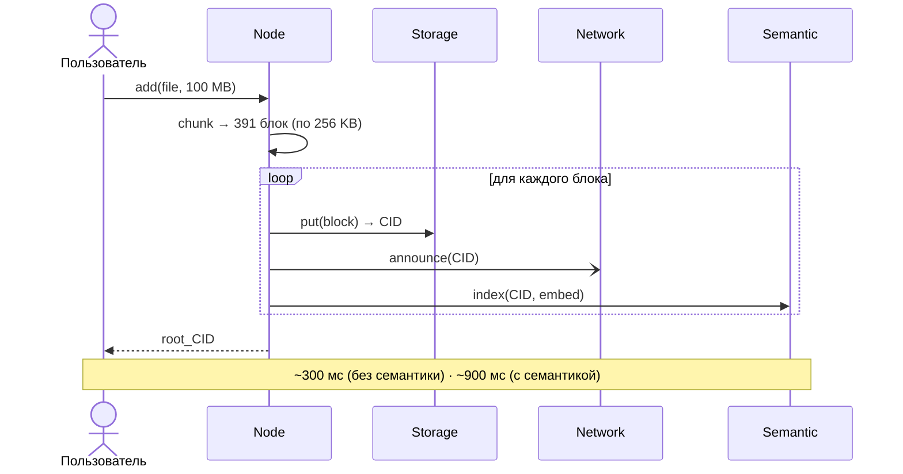
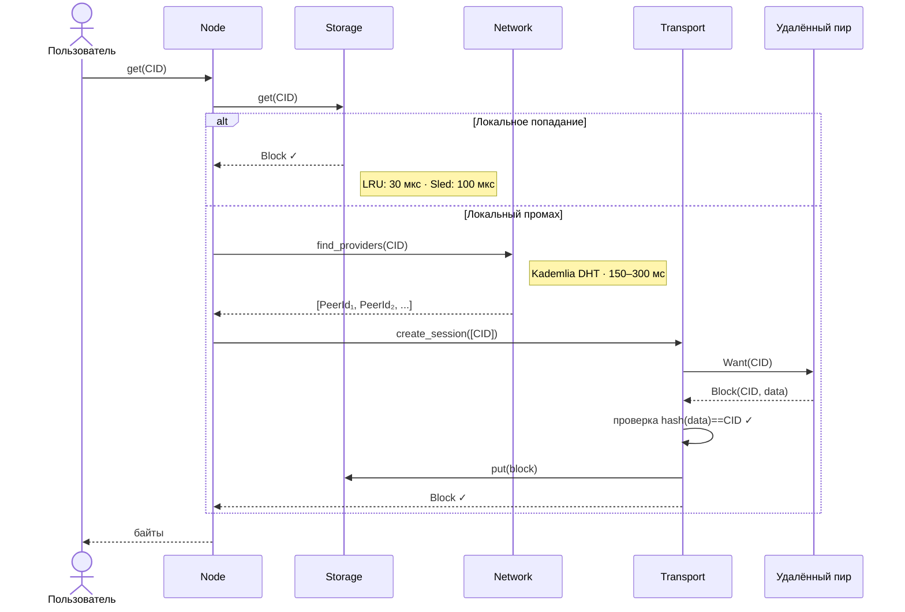
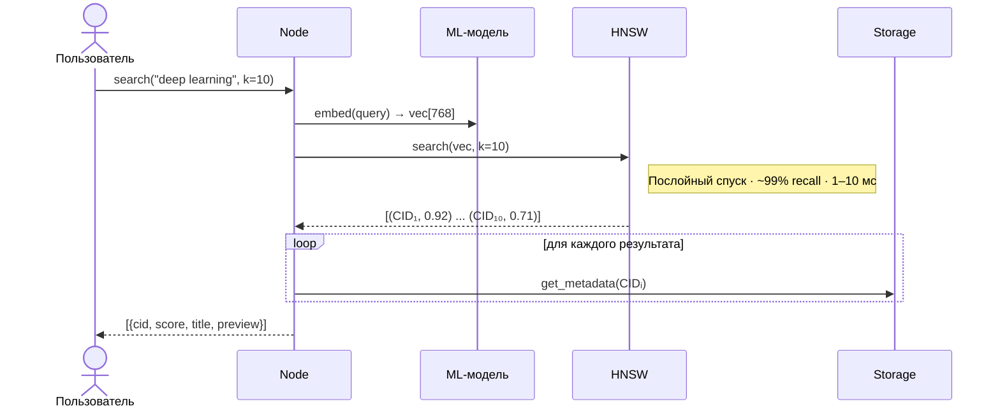
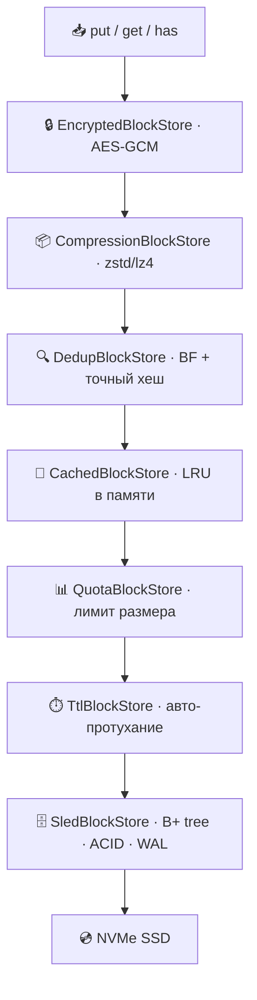
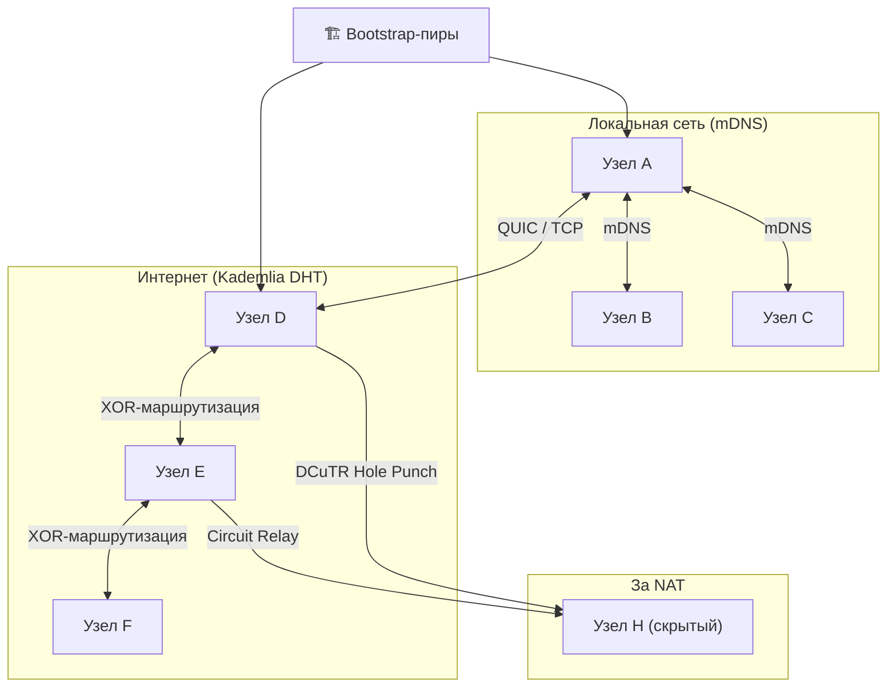
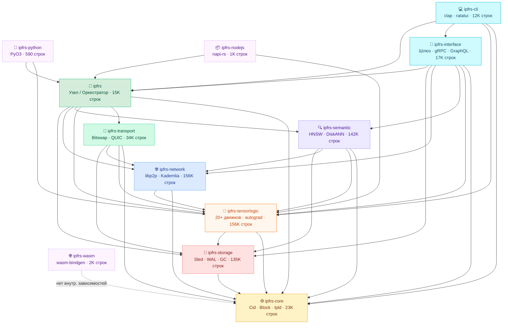

<p align="center">
  
</p>

# IPFRS — Inter-Planetary File Rust System

> Распределённая контент-адресуемая файловая система, объединяющая хранение с ML-интеллектом.  
> Файлы идентифицируются по хешу содержимого (CID). Каждый блок — сам себе адрес.

[](LICENSE)

> **Примечание о происхождении.** IPFRS — форк [cool-japan/ipfrs](https://github.com/cool-japan/ipfrs),
> исходно под лицензией Apache-2.0. Объединённая работа в этом репозитории лицензируется
> под AGPL-3.0; атрибуция и условия Apache-2.0 для исходных частей сохраняются
> (см. заголовки файлов в `ipfrs_source/`). AGPL-3.0 требует раскрытия исходного кода
> при предоставлении доступа к ПО по сети.

---

## Архитектура — вид с высоты



---

## CID — универсальный токен границы



> Любое межконтекстное взаимодействие сводится к «передай CID».

---

## Потоки данных

### ADD — сохранение файла



### GET — получение файла



### SEARCH — семантический запрос



---

## Storage — стек декораторов



> Это иллюстративный полный стек. Реально собираемый по умолчанию стек —
> **`Bloom → Cache → Sled`** (`helpers.rs:136`). Подробности в [Wiki/04-StorageContext.md](Wiki/04-StorageContext.md).

---

## Network — топология P2P



---

## Граф зависимостей крейтов



> **Ключевое наблюдение:** `ipfrs-tensorlogic` — самый «горизонтальный» крейт:  
> его импортируют 8 из 12 крейтов (network, semantic, transport, interface, cli, node, nodejs, python).

---

## Строки кода

| Крейт | Файлы | Строки |
|-------|------:|------:|
| `ipfrs-tensorlogic` | 215 | 156,899 |
| `ipfrs-network` | 225 | 156,501 |
| `ipfrs-storage` | 165 | 135,684 |
| `ipfrs-semantic` | 169 | 142,392 |
| `ipfrs-transport` | 61 | 34,299 |
| `ipfrs-core` | 51 | 23,949 |
| `ipfrs-interface` | 29 | 17,511 |
| `ipfrs` (узел) | 46 | 15,420 |
| `ipfrs-cli` | 36 | 12,821 |
| `ipfrs-wasm` | 5 | 2,726 |
| `ipfrs-nodejs` | 2 | 1,060 |
| `ipfrs-python` | 1 | 590 |
| **Итого** | **1,005** | **699,852** |

> **699,852 строк** Rust в **1,005 файлах** в 12 крейтах (без артефактов сборки).  
> **724 файла** содержат `#[cfg(test)]` — обширное инлайн-покрытие тестами.  
> **~193 внешних зависимости** в 15 файлах `Cargo.toml`.  
> **Расположение**: `ipfrs_source/` (перенесено из `Vendor/ipfrs`).  
> _Пересчитано 2026-06-19 — выверено по рабочему дереву._

---

## Документация архитектуры

| Папка / документ | Файлы | Строки |
|------------------|------:|-------:|
| `Wiki_Antropic/` | 20 | 8,853 |
| `Wiki_Arch_GLM/` | 13 | 7,188 |
| `Wiki/` (новая, DDD) | 13 | 1,890 |
| `IPFRS_ARCHITECTURE.md` | 1 | 1,599 |
| `Wiki_GLM/` | 2 | 1,544 |
| `RoadMap/` | 7 | 1,536 |
| `README.md` (корень) | 1 | 472 |
| `CONTRIBUTORS.md` | 1 | 18 |
| **Итого (архитектура)** | **58** | **23,100** |

> **23,100 строк** документации архитектуры в **58 Markdown-файлах** (7 баз знаний + корневые доки).  
> **3 «живые» вики**: [`Wiki/`](Wiki/00-INDEX.md) (DDD, выверена по коду), [`Wiki_Antropic/`](Wiki_Antropic/INDEX.md) (доменные статьи), [`Wiki_Arch_GLM/`](Wiki_Arch_GLM/00-INDEX.md) (GLM-вариант — **все 6 доменных контекстов выверены по коду**, `06-LogicContext` = 1356 строк).  
> Всего Markdown в репозитории (без `target/`, `Vendor/`): **132 файла, 57,479 строк** — остальное это доки исходников и служебное.  
> _Пересчитано 2026-06-19 — выверено по рабочему дереву._

---

## Технологический стек

| Слой | Технология |
|------|-----------|
| Рантайм | Tokio async |
| Движок хранения | Sled (B+ tree, ACID, WAL) |
| Сеть | libp2p (QUIC, TCP, Kademlia, Gossip, mDNS) |
| Векторный индекс | hnsw_rs + DiskANN |
| Вывод | Собственный Datalog + 20+ типов движков |
| TLS | rustls |
| Сериализация | DAG-CBOR (IPLD), Apache Arrow, SafeTensors |
| gRPC | tonic |
| GraphQL | async-graphql |
| Python FFI | PyO3 |
| Node.js FFI | napi-rs |
| CLI | clap |

---

## Ключевые архитектурные решения

| Решение | Выбор | Почему |
|---------|-------|--------|
| Контент-адресация | CID = hash(data) | Дедупликация, целостность, кешируемость, неизменяемость |
| Хранение | Sled B+ tree | Чистый Rust, ACID, без C-зависимостей |
| Сеть | libp2p | Проверенная, протокол-агностичная, обход NAT |
| Векторный индекс | HNSW | Запросы O(log n), ~99% recall, в памяти |
| Вывод | Horn-clause Datalog | Разрешимый, композируемый, нейро-символическая фузия |
| Транспорт | Bitswap + WantList | Параллельный обмен блоками с несколькими пирами |

---

## Известные слабые места

> Обновлено 2026-06-19 по итогам глубокого исследования (7 агентов, привязка `file:line`).
> Полный реестр — [Wiki/11-RealityCheck.md](Wiki/11-RealityCheck.md).

**Опровергнутые ранее «критические баги»** (по факту кода уже корректны):
- JWT — это **HMAC-HS256, а не MD5** — `ipfrs/src/auth.rs:461`
- Backpressure-семафор **корректно** освобождает permits — `ipfrs-interface/src/backpressure.rs:185`
- «Баг FedAvg-таймаута» в `tensorlogic_ops.rs:1131` — **файла/строки не существует**

**Реальные заглушки и слабые места:**
- **Выкачка блоков по swarm — заглушка** → `NotFound` — `ipfrs-network/src/node.rs:1311` (блокер P2P GET)
- **Целостность при чтении НЕ проверяется** (`get` без `verify()`) — `ipfrs-storage/src/blockstore.rs:350`
- **`VectorIndex::rebuild`** молча опустошает индекс — `ipfrs-semantic/src/hnsw.rs:586`
- **TLS-генератор в node-крейте — заглушка** (rcgen только в комментарии) — `ipfrs/src/tls.rs:314`
- **GraphSync / erasure (Reed-Solomon) / NAT-STUN** — заглушки — `ipfrs-transport/src/{graphsync,erasure,nat_traversal}.rs`
- **Bitswap дублирован** в `ipfrs-transport` и `ipfrs-network` (несовместимые типы)
- GC-порог `min_age` enforced только в одной из трёх реализаций GC

---

## Документация

### Структура вики (3 «живые» базы знаний)

```
Wiki/                       — НОВАЯ: DDD «как функционирует IPFRS», выверена по коду
├── 00-INDEX · README       — навигация, карта зависимостей
├── 01-DomainOverview       — домен, единый язык, инварианты
├── 02-StrategicDesign      — 7 bounded contexts, карта контекстов
├── 03-SharedKernel         — Cid / Block / Ipld
├── 04-08 контексты         — Storage · Network · Semantic · TensorLogic · Transport
├── 09-ApplicationLayer     — Node-фасад + Gateway
├── 10-DataFlows            — ADD/GET/SEARCH/INFER/FedAvg сквозь контексты
└── 11-RealityCheck         — реестр заглушек, расхождения модели с кодом

Wiki_Antropic/              — подробные доменные статьи (паттерн Карпати, RU)
├── 01-15 + 12-RealityCheck — обзор, домены, потоки, HLD, проверка реальности
└── INDEX · README · WIKI_SCHEMA · log

Wiki_Arch_GLM/              — GLM-вариант DDD-анализа (13 файлов)
```

### Исходный код

- **`ipfrs_source/`** — полная кодовая база IPFRS (перенесена в корень)
  - `crates/` — 12 Rust-крейтов (storage, network, semantic, tensorlogic и др.)
  - `Cargo.toml` — конфигурация workspace
  - `book/`, `CRATE_DOCS.md` — документация исходников

---

## Контрибьюторы

| Контрибьютор | E-mail | Роль |
|--------------|--------|------|
| Temur | rust.istio@gmail.com | Maintainer · архитектура · документация |

Полный список — в [CONTRIBUTORS.md](CONTRIBUTORS.md). Вклад приветствуется — открывайте
issue или pull request.

---

## Лицензия

Этот проект распространяется под лицензией **GNU Affero General Public License v3.0
(AGPL-3.0)** — см. файл [LICENSE](LICENSE).

> **Примечание о происхождении.** IPFRS — форк [cool-japan/ipfrs](https://github.com/cool-japan/ipfrs),
> исходно под лицензией Apache-2.0. Объединённая работа в этом репозитории лицензируется
> под AGPL-3.0; атрибуция и условия Apache-2.0 для исходных частей сохраняются
> (см. заголовки файлов в `ipfrs_source/`). AGPL-3.0 требует раскрытия исходного кода
> при предоставлении доступа к ПО по сети.

---

*Глубокий анализ: Claude Opus 4.8 · параллельный workflow из 7 агентов · 2026-06-19*
*Первичный анализ: Claude Sonnet 4.6 · 6 агентов · 2026-06-18*
