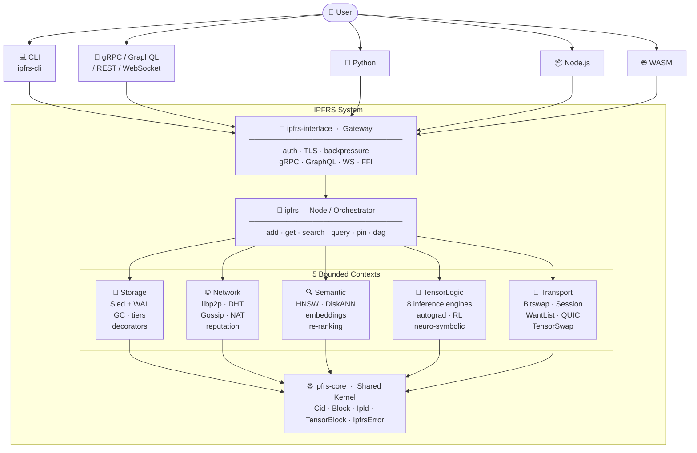
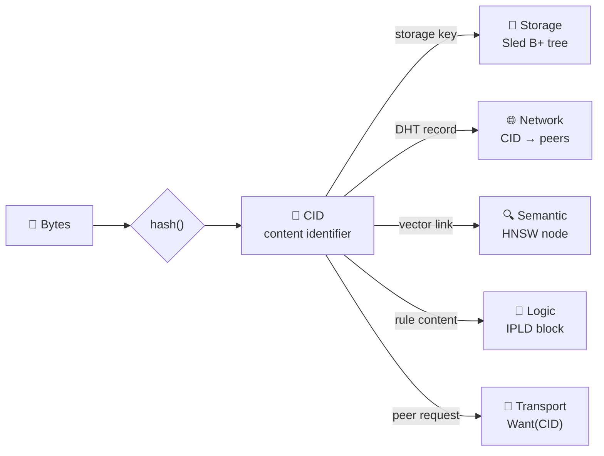
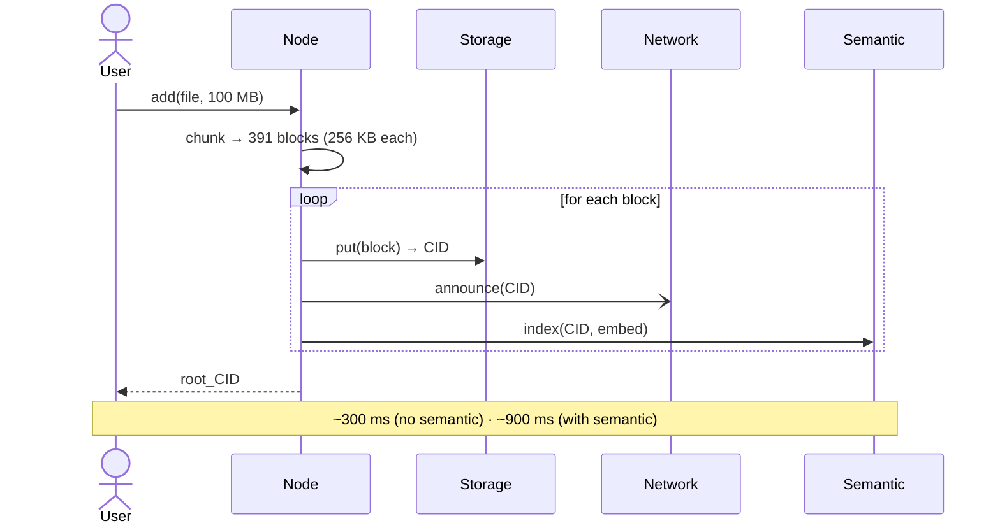
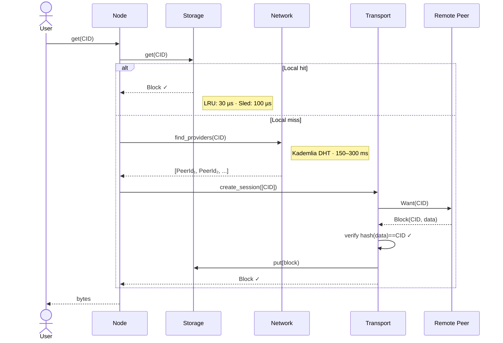
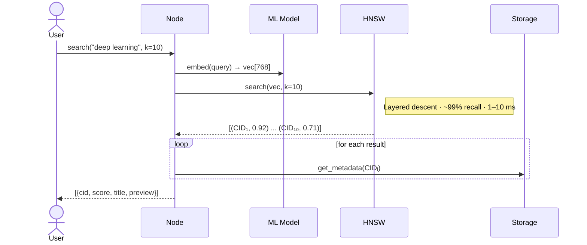
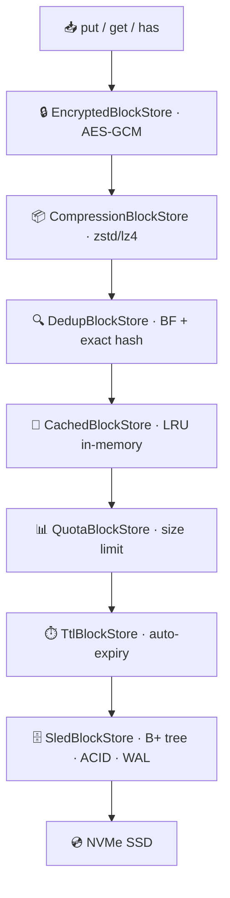
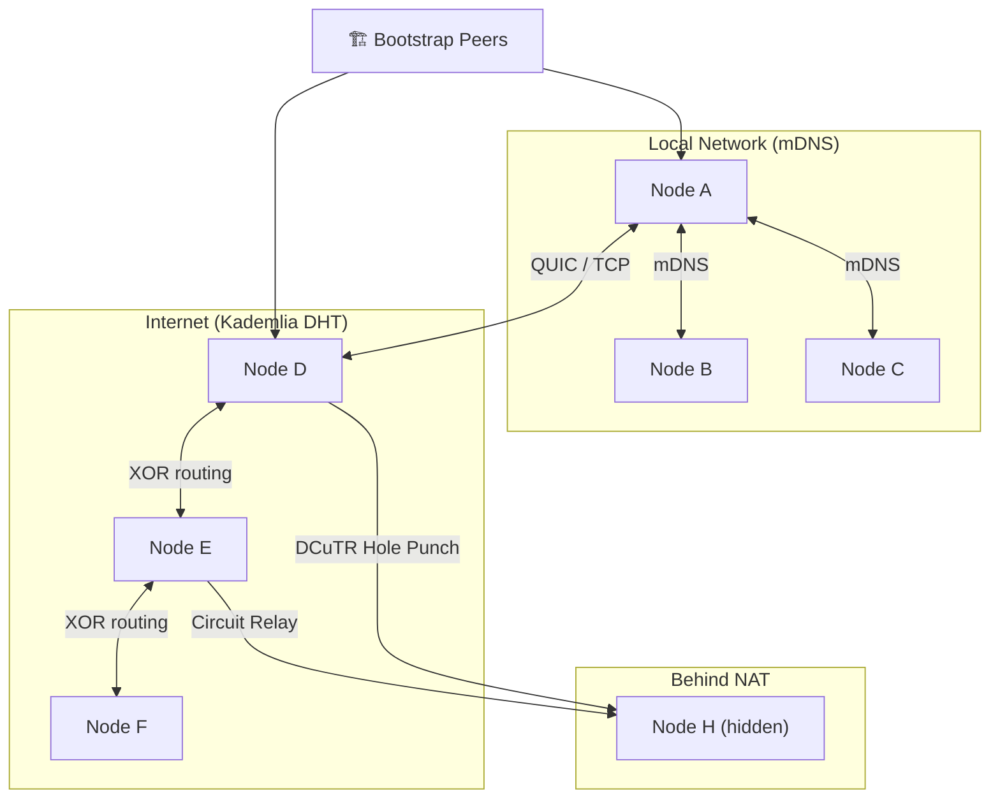
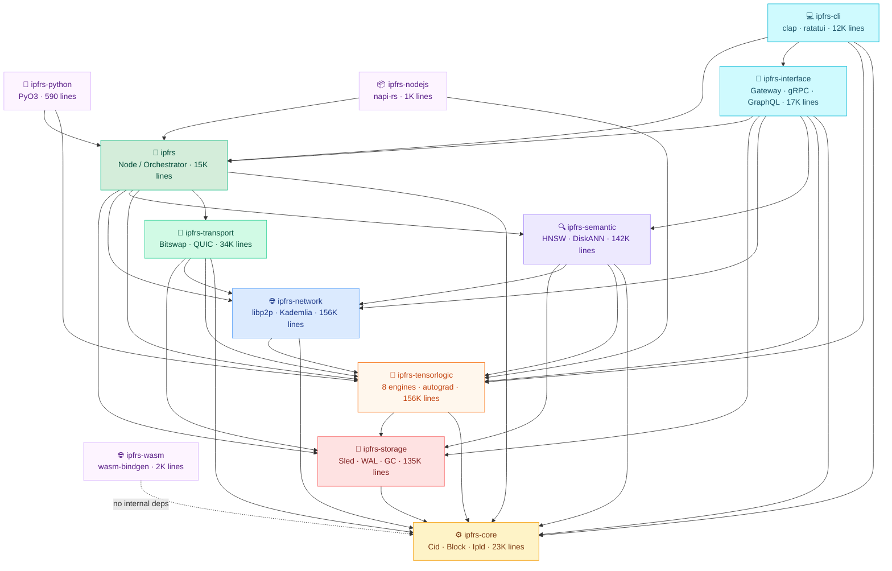

# IPFRS — Inter-Planetary File Rust System

> Distributed content-addressed file system that unifies storage with ML intelligence.  
> Files are identified by their content hash (CID). Every block is its own address.

---

## Architecture — Helicopter View



---

## CID — Universal Boundary Token



> All cross-context communication is just "pass a CID".

---

## Data Flows

### ADD — store a file



### GET — retrieve a file



### SEARCH — semantic query



---

## Storage — Decorator Stack



---

## Network — Peer-to-Peer Topology



---

## Crate Dependency Graph



> **Ключевое наблюдение:** `ipfrs-tensorlogic` — самый «горизонтальный» крейт:  
> его импортируют 8 из 12 крейтов (network, semantic, transport, interface, cli, node, nodejs, python).

---

## Lines of Code

| Crate | Files | Lines |
|-------|------:|------:|
| `ipfrs-tensorlogic` | 215 | 156,899 |
| `ipfrs-network` | 225 | 156,501 |
| `ipfrs-storage` | 165 | 135,684 |
| `ipfrs-semantic` | 169 | 142,392 |
| `ipfrs-transport` | 61 | 34,299 |
| `ipfrs-core` | 51 | 23,949 |
| `ipfrs-interface` | 29 | 17,511 |
| `ipfrs` (node) | 46 | 15,420 |
| `ipfrs-cli` | 36 | 12,821 |
| `ipfrs-wasm` | 5 | 2,726 |
| `ipfrs-nodejs` | 2 | 1,060 |
| `ipfrs-python` | 1 | 590 |
| **Total** | **1,005** | **699,852** |

> **702,768 lines** total including workspace root files.  
> **504,850 lines** of actual code (excluding blank lines and comments).  
> **724 files** contain `#[cfg(test)]` — extensive inline test coverage.  
> **~193 external dependencies** across 15 `Cargo.toml` files.  
> **Location**: `ipfrs_source/` (moved from `Vendor/ipfrs`)

---

## Tech Stack

| Layer | Technology |
|-------|-----------|
| Runtime | Tokio async |
| Storage engine | Sled (B+ tree, ACID, WAL) |
| Networking | libp2p (QUIC, TCP, Kademlia, Gossip, mDNS) |
| Vector index | hnsw_rs + DiskANN |
| Inference | Custom Datalog + 8 engine types |
| TLS | rustls |
| Serialization | DAG-CBOR (IPLD), Apache Arrow, SafeTensors |
| gRPC | tonic |
| GraphQL | async-graphql |
| Python FFI | PyO3 |
| Node.js FFI | napi-rs |
| CLI | clap |

---

## Key Architectural Decisions

| Decision | Choice | Why |
|----------|--------|-----|
| Content addressing | CID = hash(data) | Deduplication, integrity, cacheable, immutable |
| Storage | Sled B+ tree | Pure Rust, ACID, no C deps |
| Network | libp2p | Battle-tested, protocol-agnostic, NAT traversal |
| Vector index | HNSW | O(log n) queries, ~99% recall, in-memory |
| Inference | Horn clause Datalog | Decidable, composable, neuro-symbolic fusion |
| Transport | Bitswap + WantList | Parallel multi-peer block exchange |

---

## Known Weaknesses

- JWT uses **MD5** instead of HS256 — `interface/src/auth.rs:449`
- TLS cert generator returns a **stub** — `interface/src/tls.rs:314`
- Backpressure semaphore permits **not revoked** on window decrease — `backpressure.rs:182`
- Storage GC `min_age` parameter accepted but **never applied** — `gc.rs:collect`
- FedAvg **always times out** when `min_peers > 0` — `tensorlogic_ops.rs:1131`
- Arrow "zero-copy" path performs **3 actual copies** — `interface/src/arrow.rs`

---

## Documentation

### Wiki Structure

```
Wiki/ (or Wiki_Arch_Claude/)
├── 01-Overview.md          — What is IPFRS?
├── 02-ArchitectureStack.md — 6-layer stack
├── 03-BoundedContexts.md   — 5 bounded contexts (DDD)
├── 04-StorageDomain.md     — Sled, blocks, decorators, GC
├── 05-NetworkDomain.md     — libp2p, DHT, peer discovery
├── 06-SemanticDomain.md    — HNSW, vector search
├── 07-LogicDomain.md       — Backward chaining, inference
├── 08-TransportDomain.md   — Bitswap, sessions
├── 09-DataFlows.md         — 4 end-to-end flows
├── 10-Performance.md       — P50/P99/P999 latency table
├── 11-ErrorHandling.md     — Recovery strategies
├── 12-MasterArchitecture.md — Full DDD analysis (RU)
├── 13-DeepArchitecture.md  — Deep architecture (RU)
├── 14-HLD.md               — Helicopter view (ASCII)
└── 15-HLD-Mermaid.md       — Helicopter view (Mermaid)
```

### Source Code

- **`ipfrs_source/`** — Complete IPFRS codebase (moved to root)
  - `crates/` — 12 Rust crates (storage, network, semantic, tensorlogic, etc.)
  - `Cargo.toml` — Workspace configuration
  - `ARCHITECTURE_*.md` — Original architecture docs

---

*Analyzed with Claude Sonnet 4.6 · 6-agent parallel workflow · 2026-06-18*
