# IPFRS: Helicopter View (Mermaid HLD)

> Все диаграммы рендерятся нативно в Obsidian.  
> Текстовая версия: [[14-HLD]]

---

## 1. Контекст системы (C4 Level 1)

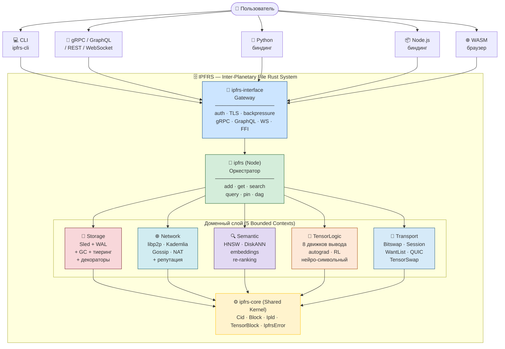

---

## 2. CID — универсальный граничный токен

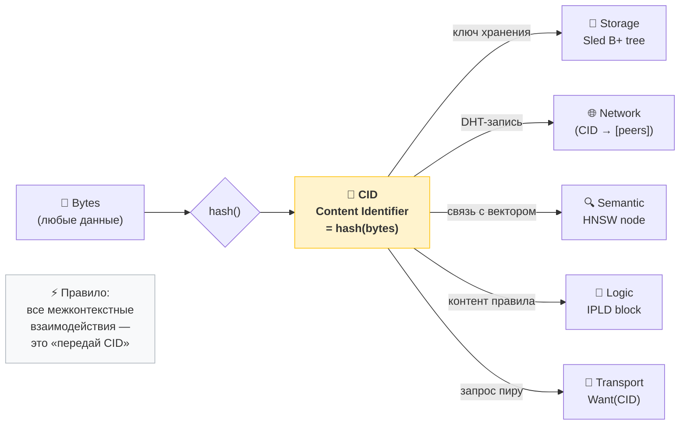

---

## 3. Карта контекстов (Context Map DDD)

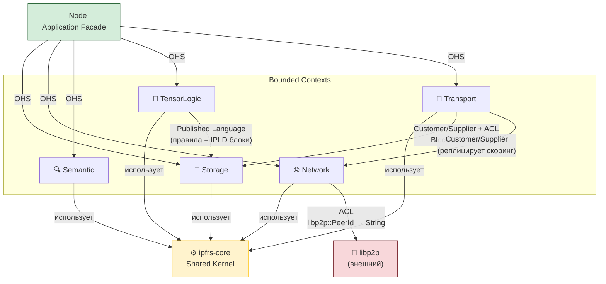

---

## 4. Стек декораторов Storage

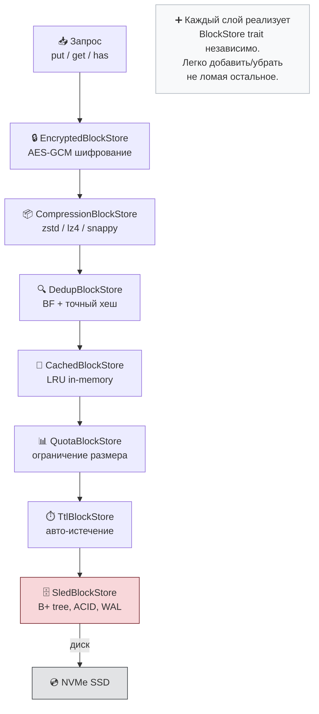

---

## 5. Поток ADD (добавить файл)

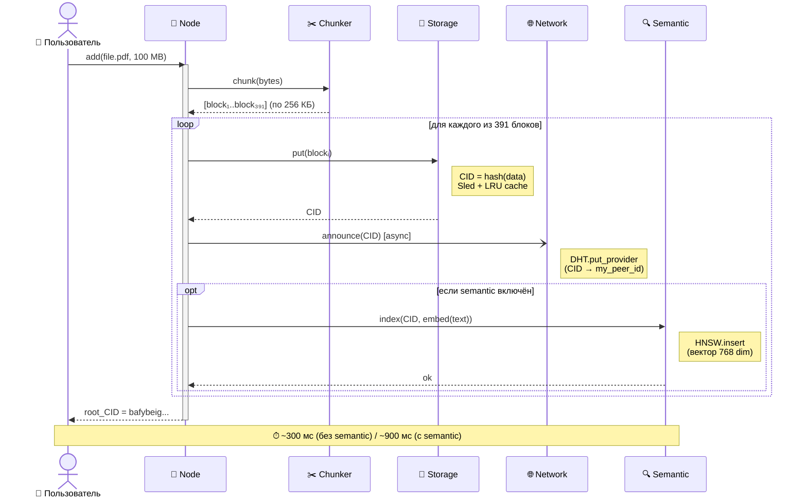

---

## 6. Поток GET (получить файл)

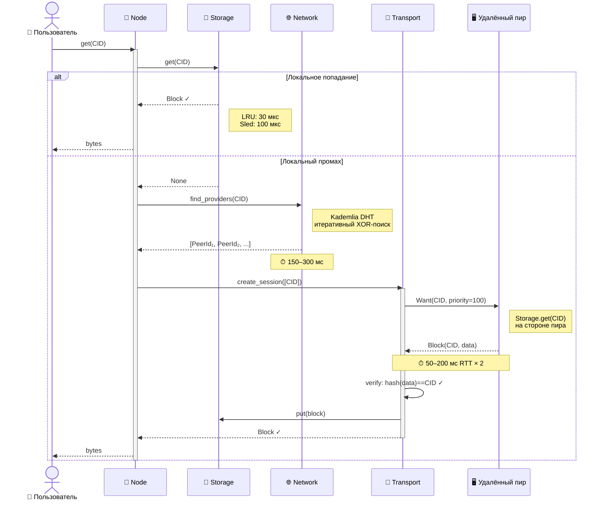

---

## 7. Поток SEARCH (семантический поиск)

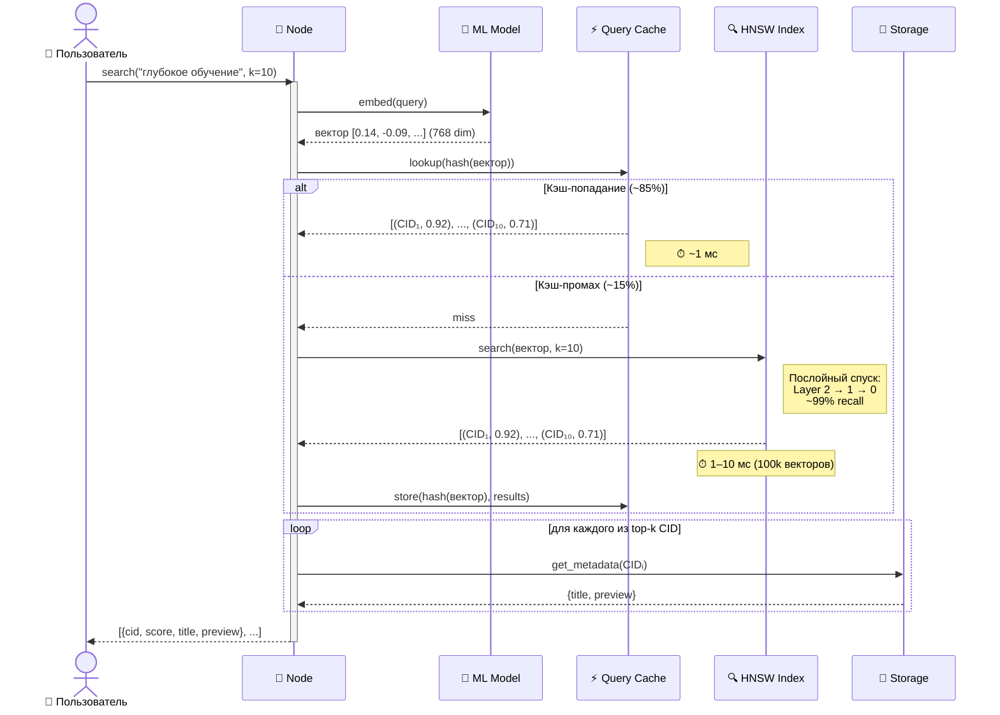

---

## 8. Поток QUERY (логический запрос)

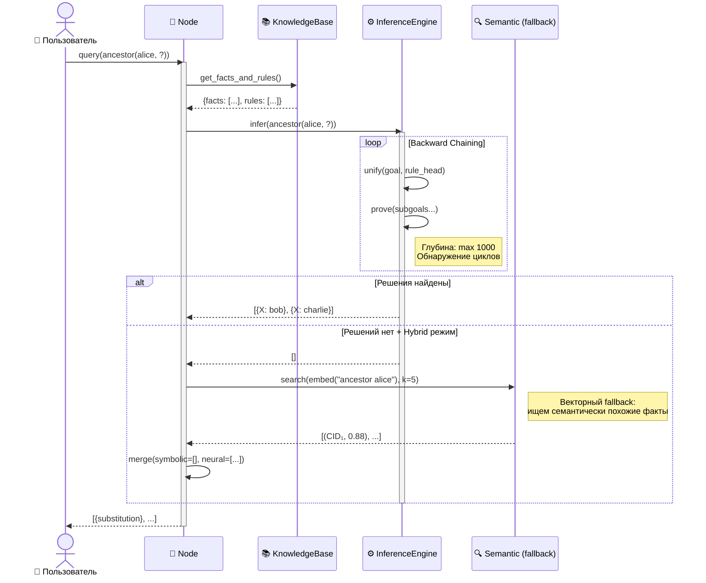

---

## 9. Топология сети peer-to-peer

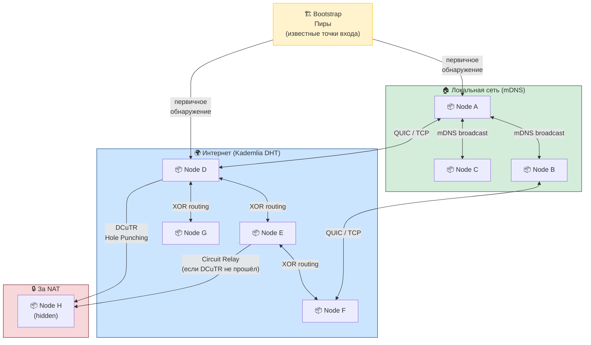

---

## 10. Машина состояний Transport-сессии

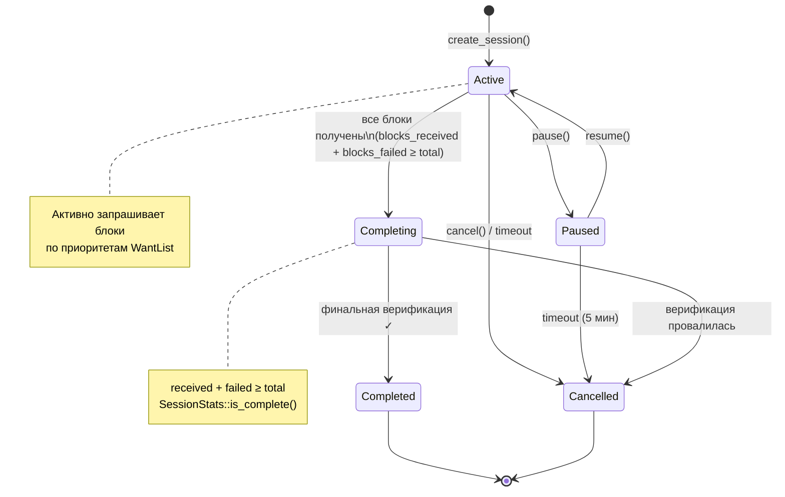

---

## 11. Репутация пиров — два уровня

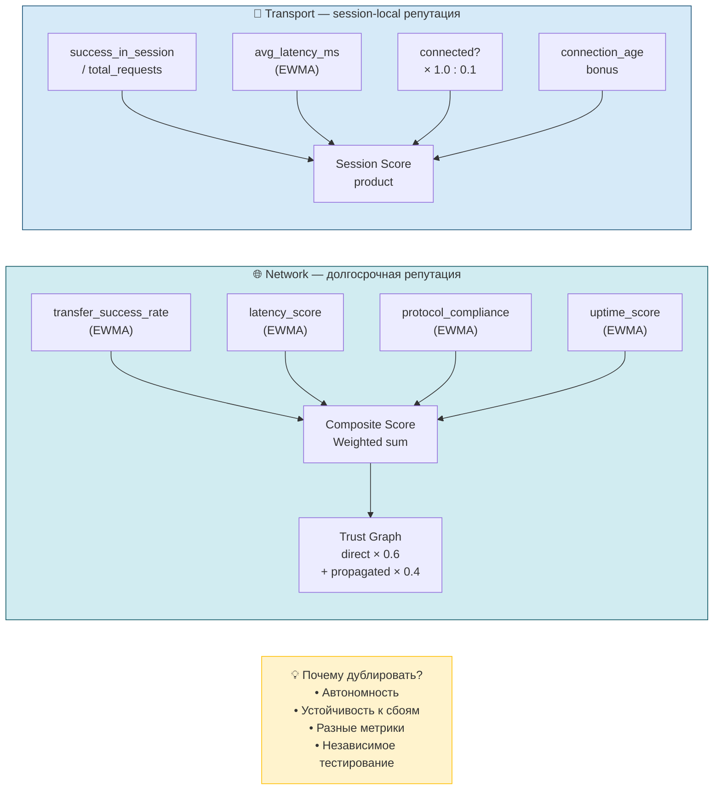

---

## 12. Нейро-символьное слияние (TensorLogic)

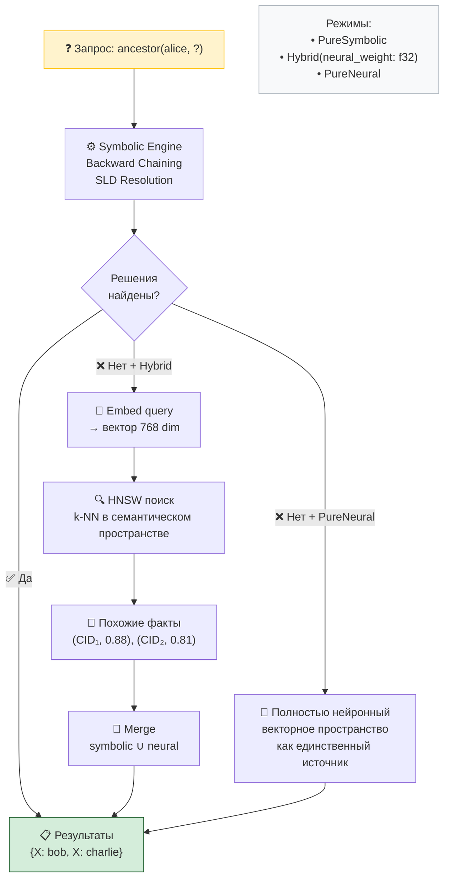

---

## 13. Стек технологий

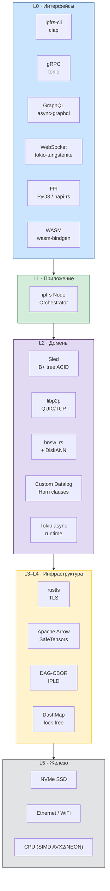

---

## 14. NFR — нефункциональные требования

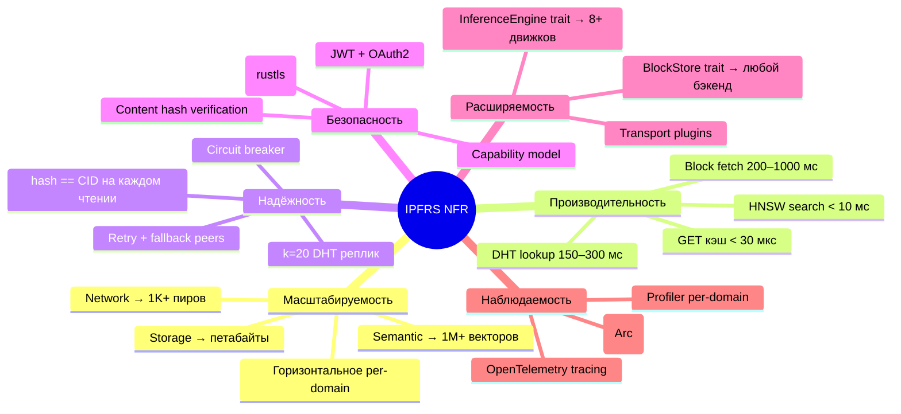

---

## Навигация

| Хочу узнать | Читай |
|-------------|-------|
| Только текстовые диаграммы | [[14-HLD]] |
| Полный DDD-анализ | [[12-MasterArchitecture]] |
| Глубокое погружение | [[13-DeepArchitecture]] |
| Домен Storage | [[04-StorageDomain]] |
| Домен Network | [[05-NetworkDomain]] |
| Семантический поиск | [[06-SemanticDomain]] |
| Логика и вывод | [[07-LogicDomain]] |
| Транспорт Bitswap | [[08-TransportDomain]] |
| Все потоки данных | [[09-DataFlows]] |

---

**Связанные**: [[14-HLD]] | [[01-Overview]] | [[03-BoundedContexts]] | [[09-DataFlows]] | [[12-MasterArchitecture]]
